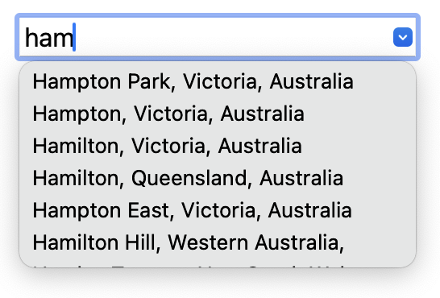

# autocompleteCity

### A faster alternative to Google Maps Place Autocomplete



This project takes a different approach to those input fields where you can enter your city/location and get it auto-completed: The city lookups are performed client-side, so no communication with a server is needed.

This presents both advantages and disadvantages compared to the "normal" way of doing it (using an API such as e.g. Google Maps Place Autocomplete). Let's hear the bad news first:

### Cons of using autocompleteCity instead of Google Maps Place Autocomplete:

- **No localization.** The city names are in English, so for instance, if visitors to your website who live in Munich in Germany input the name of their city, they'll have to write *Munich* as opposed to the German *München*.
- **Semi-large file:** The city data and the JS code combined are about 2.6 MB, although when sent over HTTP, your server will probably compress them down to about 1 MB. That is (depending on the speed of your users' Internet connection) tolerable, but certainly not ideal. Do keep in mind, though, that only the page/view that contains the autocomplete widget needs to include those 1 MB.
- **Only cities:** This project only allows you to autocomplete cities, not landmarks, restaurants, etc.
- **Only cities with at least 5,000 inhabitants are autocompleted.** If you want cities down to 1,000 inhabitants to be autocompleted (which will make the file size considerably bigger), check the FAQ below.

### Pros of using autocompleteCity instead of Google Maps Place Autocomplete:

- **It's quick to install.** While the available APIs out there such as Place Autocomplete might be easy to use, you often spend time having to deal with map users, tokens, researching pricing and setting up billing. By contrast, autocompleteCity is install-and-go.
- **It's free.** The map APIs out there start charging you when your website becomes popular, and even if your website never reaches that level of visitors, you'll still often have to set up billing in advance.
- **It's fast.** Since everything happens client-side, no HTTP communcation with a server is needed, and the autocompletion input is not vulnerable to server issues such as downtime.
- **It's more stable in the long run:** Popular map services change their APIs relatively frequently which means you might be forced to update your autocompletion widget down the line. With autocompleteCity, everything will still work in 5-10 years.

## Demo

Simply download the files and open demo.html in a browser.

## Install

#### **Note: If your project uses Vue, you should probably take a look at the [Vue version of this project](https://github.com/kode95/vueAutocompleteCity). For everyone else, please continue:**

1. Upload the file autocompleteCity.js to your server.

1. Put the following into an HTML file, and make sure the path to autocompleteCity.js in ```<script src="..."``` matches where you uploaded the file to:

```html
<input list="autocomplete-city-list" autocomplete="off">

<datalist id="autocomplete-city-list"></datalist>

<script src="autocompleteCity.js"></script>
<script>
  autocompleteCity(
    document.querySelector('input[list=autocomplete-city-list]'),
    document.getElementById('autocomplete-city-list'),
    (city) => {
      console.log(city)
    }
  )
</script>
```

Next, change the line ```console.log(city)``` to whatever code you would like to run when the user has entered and selected a city. The ```city``` object in that line contains information about the selected city such as its location, region, etc. See the FAQ for an example of how your custom code could look.

## FAQ

### How do I style the city input field?

autocompleteCity doesn't include any CSS, and the input field is a normal text input field that you can style using your own CSS however you want. Note that the list of cities that appear when you start typing a city is made using the HTML element ```<datalist>``` which can be a bit difficult to style. This is rarely a problem, though, since ```<datalist>``` looks good in most browsers by default.

### How do I save the city data that the user selected?

You can modify the custom function to look like this:
```js
(city) => {
  let inputName, input
  for (let prop in city) {
    inputName = `autocomplete-city-${prop}`
    if (document.getElementsByName(inputName).length) {
      document.getElementsByName(inputName)[0].value = city[prop]
    } else {
      input = document.createElement('input')
      input.type = 'hidden'
      input.name = inputName
      input.value = city[prop]
      document.body.appendChild(input)
    }
  }
}
```
This puts everything in the city object into hidden input fields where they can be easily saved on the server-side once the user submits your form.

### Why doesn't the custom function that is run when the user selects a city run immediately?

The custom function (```console.log(city)``` in the example above) is invoked via the *change* event on the input field (this is necessary since it's currently not possible to attach events to a ```<datalist>``` element). The *change* event in some cases doesn't fire until the visitor unfocuses the input field.

### How do I add more cities to the data?

As mentioned above, the city data only includes cities down to 5,000 inhabitants. This is to keep the file size to a decent size. If you want to include cities all the way down to 1,000 inhabitants, see the [geonames2js](https://github.com/kode95/geonames2js) readme for info about how to download the city file containing cities with 1,000+ inhabitants. Once the geoNames.js file has been generated, move it into the src directory of autocompleteCity, open a terminal, and run ```sh build.sh``` from inside the src directory.

### Where does the city data come from?

It comes from [GeoNames](https://www.geonames.org/) and gets downloaded and processed via another project of mine; [geonames2js](https://github.com/kode95/geonames2js).
